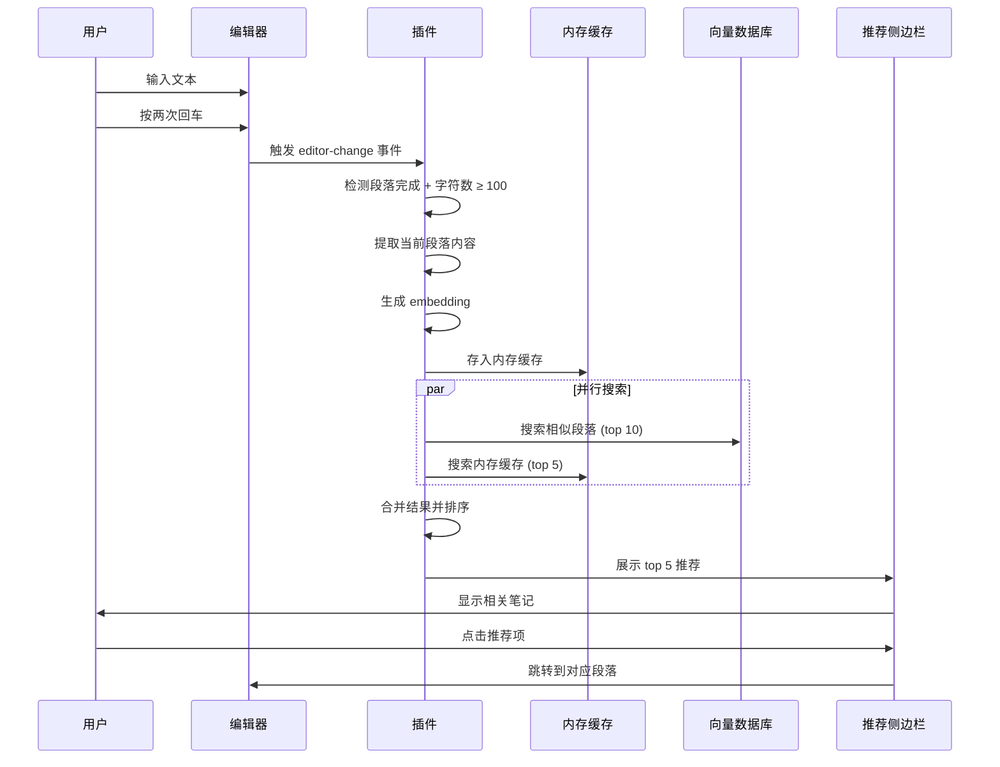

# Obsidian 语义搜索插件 - PRD v0.2.0

## 版本信息

-   **版本号**: 0.2.0
-   **版本代号**: "智能关联"
-   **基于版本**: v0.1.0 (基础搜索功能)
-   **发布日期**: 2026-02-15 (预计)
-   **文档更新**: 2026-01-13

---

## 1. 版本概述

### 1.1 核心目标

v0.2.0 版本将插件从**文档级搜索**升级为**段落级智能关联系统**，实现"卡片笔记法"的核心理念：让知识自动连接，发现隐藏的关联。

### 1.2 核心价值主张

> **"写作时，自动发现你忘记的相关笔记"**

用户在写作时，系统会：

1. 理解你正在写的内容
2. 在你的知识库中找到相关的历史笔记
3. 在侧边栏自动展示，帮助你建立连接

### 1.3 版本升级对比

| 功能         | v0.1.0       | v0.2.0             |
| ------------ | ------------ | ------------------ |
| **搜索粒度** | 文档级       | 段落级（含行号）   |
| **搜索方式** | 手动输入查询 | 手动 + 自动推荐    |
| **索引方式** | 手动索引     | 自动增量索引       |
| **内容理解** | 仅向量       | 向量 + 摘要 + 标签 |
| **跳转精度** | 文件开头     | 具体段落行号       |

---

## 2. 业务场景与用户故事

### 场景 1: 学习新知识时发现旧笔记

**角色**: 技术博主小李

**背景**: 小李在学习 Rust 的异步编程，写下了一段笔记：

```markdown
## Rust 异步编程

Rust 的 async/await 语法让异步代码看起来像同步代码。
Future trait 是核心抽象，类似于 JavaScript 的 Promise。
tokio 是最流行的异步运行时，提供了任务调度和 IO 多路复用。
```

**期望**:

-   当小李输入完这段话并按两次回车时
-   侧边栏自动显示他 3 个月前写的《JavaScript Promise 详解》
-   小李想起可以做个对比，于是添加了一节"与 JavaScript Promise 的对比"

**价值**: 避免重复造轮子，建立知识间的连接

---

### 场景 2: 写作时快速定位相关段落

**角色**: 产品经理小王

**背景**: 小王在写新产品的 PRD，需要引用之前项目的用户研究结论。

**操作流程**:

1. 小王在搜索框输入"用户对价格的敏感度"
2. 系统返回 5 个相关段落（而非整个文档）
3. 每个结果显示：
    - 📝 `产品调研/2025-Q3-用户访谈.md` (行 45-52)
    - "我们发现年轻用户对价格更敏感，愿意为便利性支付溢价的比例仅 23%..."
    - 相似度: 94.2%
4. 点击结果，编辑器自动跳转到第 45 行并高亮该段落

**价值**: 从"找到文档"升级为"找到段落"，节省 80% 的查找时间

---

### 场景 3: 防止知识孤岛

**角色**: 研究生小张

**背景**: 小张在不同时间、不同笔记中记录了关于"注意力机制"的内容，但从未意识到它们的关联。

**系统行为**:

-   小张在写《Transformer 架构解析》时
-   系统自动推荐：
    -   📝 `深度学习/注意力机制基础.md` (行 12-28)
    -   📝 `论文笔记/Attention-Is-All-You-Need.md` (行 67-89)
    -   📝 `计算机视觉/ViT模型.md` (行 34-45)
-   小张发现这些笔记可以整合成一个系列

**价值**: 自动发现隐藏的知识关联，构建知识网络

---

### 场景 4: 增量索引的无感体验

**角色**: 日记用户小陈

**背景**: 小陈每天写日记，不想手动索引。

**系统行为**:

1. **写作中**: 小陈写完一段话（100+ 字符，双换行）
    - 系统在内存中生成 embedding
    - 立即可用于推荐，但不写入数据库
2. **保存文件**: 小陈按 `Ctrl+S` 保存
    - 系统批量将新段落写入 Qdrant
    - 显示通知："已索引 3 个新段落"
3. **关闭文件**: 小陈关闭文件但忘记保存
    - 系统提示："有 2 个段落未保存，索引未更新"
    - 小陈可以选择保存或忽略

**价值**: 零学习成本，自动化索引

---

## 3. 核心功能设计

### 3.1 段落级搜索

#### 3.1.1 功能描述

将搜索结果从"文档"细化到"段落"，并支持精确跳转。

#### 3.1.2 技术实现

**数据结构**:

```typescript
interface ChunkMetadata {
    file_path: string; // 文件路径
    chunk_id: string; // 唯一标识，如 "rust.md#h1-intro#h2-ownership"
    start_line: number; // 起始行号（1-indexed）
    end_line: number; // 结束行号（inclusive）
    header_path: string; // 标题路径，如 "# Rust 学习 > ## 所有权"
    content: string; // 段落内容
    point_type: "text" | "image";

    // v0.2.0 新增字段
    summary: string; // AI 生成的摘要（1-2 句话）
    tags: string[]; // 关键词标签（3-5 个）
    category: string; // 分类（技术/生活/想法等）
    word_count: number; // 字数
    created_at: number; // 创建时间戳
    updated_at: number; // 更新时间戳
}
```

**Qdrant Payload 示例**:

```json
{
    "file_path": "/学习笔记/Rust/所有权系统.md",
    "chunk_id": "rust-ownership.md#h1-rust#h2-ownership",
    "start_line": 15,
    "end_line": 28,
    "header_path": "# Rust 学习 > ## 所有权系统",
    "content": "Rust 的所有权系统是其最核心的特性...",
    "point_type": "text",
    "summary": "介绍 Rust 所有权系统的三大规则：每个值有唯一所有者、离开作用域自动释放、所有权可转移但不可复制。",
    "tags": ["rust", "所有权", "内存安全", "编译器"],
    "category": "技术笔记",
    "word_count": 245,
    "created_at": 1705132800000,
    "updated_at": 1705132800000
}
```

#### 3.1.3 搜索结果展示

**UI 设计**:

```
┌─────────────────────────────────────────┐
│  🔍 语义搜索                             │
├─────────────────────────────────────────┤
│  [Rust 内存安全]                  [搜索] │
├─────────────────────────────────────────┤
│  找到 3 个段落                           │
├─────────────────────────────────────────┤
│  📝 Rust/所有权系统.md          94.2%   │
│  📍 行 15-28 · # Rust 学习 > ## 所有权   │
│  💡 介绍 Rust 所有权系统的三大规则...    │
│  🏷️ rust · 所有权 · 内存安全            │
│  ─────────────────────────────────────  │
│  Rust 的所有权系统是其最核心的特性。     │
│  每个值都有一个所有者，当所有者离开...   │
│                                         │
│  [点击跳转到段落]                        │
├─────────────────────────────────────────┤
│  📝 编程语言/内存管理对比.md     87.5%  │
│  📍 行 45-62 · # 内存管理 > ## 静态检查  │
│  💡 对比了 Rust、C++ 和 Go 的内存...    │
│  🏷️ 内存管理 · 静态分析 · 对比          │
└─────────────────────────────────────────┘
```

**交互行为**:

1. **点击结果卡片**:

    - 在编辑器中打开文件
    - 滚动到 `start_line`
    - 高亮 `start_line` 到 `end_line` 的内容（持续 2 秒）

2. **Hover 显示完整摘要**: 鼠标悬停时显示完整的 summary

3. **右键菜单**:
    - "在新标签页打开"
    - "复制段落链接"（生成 `[[文件名#标题]]` 格式）
    - "查看相似段落"

#### 3.1.4 测试用例

**TC-2.1.1: 基础段落搜索**

-   **前置条件**: 已索引包含 10+ 段落的文档
-   **操作**: 搜索"Rust 内存安全"
-   **预期**:
    -   返回 3-5 个相关段落
    -   每个结果包含 `start_line`, `end_line`, `header_path`
    -   按相似度降序排列

**TC-2.1.2: 段落精确跳转**

-   **前置条件**: 搜索结果中有段落位于第 45-52 行
-   **操作**: 点击该结果
-   **预期**:
    -   编辑器打开对应文件
    -   光标定位到第 45 行
    -   第 45-52 行高亮显示（黄色背景，2 秒后消失）

**TC-2.1.3: 标题路径显示**

-   **前置条件**: 段落位于嵌套标题下（如 `# H1 > ## H2 > ### H3`）
-   **操作**: 查看搜索结果
-   **预期**: 显示完整标题路径，用 `>` 分隔

**TC-2.1.4: 空结果处理**

-   **前置条件**: 数据库中无相关内容
-   **操作**: 搜索"不存在的内容 xyz123"
-   **预期**: 显示"未找到相关段落，试试其他关键词"

---

### 3.2 段落信息提取与标签

#### 3.2.1 功能描述

在索引时，使用 AI 模型对每个段落进行分析，提取：

-   **摘要** (summary): 1-2 句话概括
-   **标签** (tags): 3-5 个关键词
-   **分类** (category): 技术/生活/想法/读书笔记等

#### 3.2.2 技术方案

**使用 Ollama 本地模型**:

```typescript
// 提示词模板
const EXTRACTION_PROMPT = `
请分析以下 Markdown 段落，提取关键信息。

段落内容：
"""
{content}
"""

请以 JSON 格式返回：
{
  "summary": "一句话概括（20-40 字）",
  "tags": ["标签1", "标签2", "标签3"],
  "category": "技术笔记" // 可选：技术笔记/生活日记/读书笔记/想法灵感/工作记录
}

要求：
- summary 要简洁准确，突出核心观点
- tags 选择最重要的 3-5 个关键词
- category 从上述 5 个分类中选择最合适的一个
`;

// 调用示例
async function extractMetadata(content: string): Promise<ChunkMetadata> {
    const response = await ollama.generate({
        model: "llama3.2:3b", // 使用小模型，速度快
        prompt: EXTRACTION_PROMPT.replace("{content}", content),
        format: "json",
    });

    return JSON.parse(response.response);
}
```

**性能优化**:

-   批量处理：一次索引多个段落时，批量调用 Ollama
-   缓存：相同内容不重复提取
-   降级：如果 Ollama 不可用，使用规则方案（提取标题作为摘要，TF-IDF 提取关键词）

#### 3.2.3 规则方案（降级备选）

当 Ollama 不可用时，使用简单规则：

```typescript
function extractMetadataFallback(
    content: string,
    headerPath: string
): ChunkMetadata {
    return {
        summary: headerPath || content.slice(0, 50) + "...",
        tags: extractKeywordsWithTFIDF(content, 5),
        category: inferCategoryByKeywords(content),
    };
}

// 简单的分类推断
function inferCategoryByKeywords(content: string): string {
    const keywords = content.toLowerCase();
    if (/code|function|class|api|bug/.test(keywords)) return "技术笔记";
    if (/今天|心情|感觉|想到/.test(keywords)) return "生活日记";
    if (/读了|书中|作者认为/.test(keywords)) return "读书笔记";
    if (/想法|灵感|或许可以/.test(keywords)) return "想法灵感";
    return "工作记录";
}
```

#### 3.2.4 测试用例

**TC-2.2.1: AI 提取摘要**

-   **前置条件**: Ollama 服务运行中，已加载 llama3.2:3b
-   **操作**: 索引一段 200 字的技术笔记
-   **预期**:
    -   生成 20-40 字的摘要
    -   摘要准确概括核心内容
    -   耗时 < 2 秒

**TC-2.2.2: 标签提取准确性**

-   **前置条件**: 索引关于"Rust 所有权系统"的段落
-   **操作**: 查看提取的 tags
-   **预期**:
    -   包含 "rust", "所有权" 等核心关键词
    -   标签数量 3-5 个
    -   无无意义标签（如"的", "是"）

**TC-2.2.3: 分类准确性**

-   **前置条件**: 索引不同类型的段落
-   **操作**:
    -   索引技术文章 → 预期 category = "技术笔记"
    -   索引日记 → 预期 category = "生活日记"
    -   索引读书笔记 → 预期 category = "读书笔记"
-   **预期**: 分类准确率 > 80%

**TC-2.2.4: 降级方案**

-   **前置条件**: Ollama 服务未启动
-   **操作**: 索引段落
-   **预期**:
    -   自动使用规则方案
    -   仍能生成 summary, tags, category
    -   显示警告："AI 提取不可用，使用基础规则"

---

### 3.3 自动关联推荐

#### 3.3.1 功能描述

在用户写作时，自动检测段落完成，查找相关笔记并在侧边栏展示。

#### 3.3.2 触发机制

**触发条件**（同时满足）:

1. 用户输入两个连续换行符（`\n\n`）
2. 当前段落字符数 ≥ 阈值（默认 100，可配置）
3. 距离上次触发 > 1 秒（防抖）

**配置项**:

```typescript
interface AutoRecommendationSettings {
    enabled: boolean; // 是否启用（默认 true）
    minCharsToTrigger: number; // 最小字符数（默认 100）
    triggerOnParagraphEnd: boolean; // 双换行触发（默认 true）
    maxRecommendations: number; // 最大推荐数（默认 5）
    includeUnsavedContent: boolean; // 包含未保存内容（默认 true）
}
```

#### 3.3.3 用户界面

**设置页面**:

```
┌─────────────────────────────────────────────────┐
│  🔗 自动关联推荐                                 │
├─────────────────────────────────────────────────┤
│  ☑ 启用自动推荐                                  │
│     当你完成一个段落时，自动查找相关笔记          │
│                                                 │
│  最小触发字符数: [100] 字符                      │
│     只有段落长度超过此值才会触发推荐              │
│                                                 │
│  💡 100 字符示例：                               │
│  ┌───────────────────────────────────────────┐ │
│  │ 今天学习了 Rust 的所有权系统，这是 Rust    │ │
│  │ 最核心的特性之一。所有权系统通过编译时检查  │ │
│  │ 来保证内存安全，避免了悬垂指针、双重释放等  │ │
│  │ 常见问题。每个值都有一个所有者，当所有者    │ │
│  │ 离开作用域时，值会被自动释放。这种设计让    │ │
│  │ Rust 在没有垃圾回收的情况下也能保证内存    │ │
│  │ 安全。                                     │ │
│  │ （共 123 字符）                            │ │
│  └───────────────────────────────────────────┘ │
│                                                 │
│  ☑ 双换行时触发推荐                              │
│     在段落结束（按两次回车）时自动查找相关内容    │
│                                                 │
│  最大推荐数量: [5] 个                            │
│                                                 │
│  ☑ 推荐时包含未保存内容                          │
│     在查找相关笔记时，也搜索当前会话中未保存的段落 │
└─────────────────────────────────────────────────┘
```

**推荐侧边栏**:

```
┌─────────────────────────────────────────┐
│  🔗 相关笔记推荐                         │
│  基于当前段落自动查找                     │
├─────────────────────────────────────────┤
│  💡 正在分析当前段落...                  │  ← 加载状态
├─────────────────────────────────────────┤
│  📝 Rust/所有权系统.md          92.3%   │
│  📍 行 15-28                            │
│  介绍 Rust 所有权系统的三大规则...       │
│  🏷️ rust · 所有权 · 内存安全            │
├─────────────────────────────────────────┤
│  📝 编程语言/内存管理.md        85.6%   │
│  📍 行 45-62                            │
│  对比了 Rust、C++ 和 Go 的内存...       │
│  🏷️ 内存管理 · 静态分析                 │
├─────────────────────────────────────────┤
│  [刷新推荐] [手动触发]                   │
└─────────────────────────────────────────┘
```

#### 3.3.4 交互流程



#### 3.3.5 测试用例

**TC-2.3.1: 基础触发**

-   **前置条件**: 启用自动推荐，阈值 100 字符
-   **操作**:
    1. 输入 120 字符的段落
    2. 按两次回车
-   **预期**:
    -   1 秒内侧边栏显示"正在分析..."
    -   2-3 秒内显示推荐结果
    -   推荐数量 ≤ 5

**TC-2.3.2: 字符数不足不触发**

-   **前置条件**: 阈值 100 字符
-   **操作**: 输入 50 字符 + 双换行
-   **预期**: 不触发推荐，侧边栏无变化

**TC-2.3.3: 防抖机制**

-   **前置条件**: 防抖时间 1 秒
-   **操作**:
    1. 输入段落 A + 双换行
    2. 0.5 秒后输入段落 B + 双换行
-   **预期**: 只触发一次推荐（针对段落 B）

**TC-2.3.4: 手动触发**

-   **前置条件**: 光标在某段落内
-   **操作**: 执行命令"查找相关笔记"或按快捷键
-   **预期**: 立即分析当前段落并显示推荐

**TC-2.3.5: 包含未保存内容**

-   **前置条件**:
    -   启用"包含未保存内容"
    -   当前文件有 2 个未保存段落在内存缓存中
-   **操作**: 触发推荐
-   **预期**:
    -   推荐结果中可能包含未保存段落
    -   未保存段落标记为 "⚠️ 未保存"

**TC-2.3.6: 禁用自动推荐**

-   **前置条件**: 关闭"启用自动推荐"
-   **操作**: 输入段落 + 双换行
-   **预期**: 不触发推荐

---

### 3.4 增量索引系统

#### 3.4.1 功能描述

自动检测文件变化，增量更新向量数据库，无需用户手动操作。

#### 3.4.2 架构设计

**双层存储架构**:

```
┌─────────────────────────────────────────────┐
│  用户写作                                    │
└──────────────┬──────────────────────────────┘
               │
               ▼
┌─────────────────────────────────────────────┐
│  段落完成检测                                │
│  - 双换行 + 字符数检查                       │
└──────────────┬──────────────────────────────┘
               │
               ▼
┌─────────────────────────────────────────────┐
│  生成 Embedding + 提取元数据                 │
│  - Ollama embedding                         │
│  - AI 提取 summary/tags/category            │
└──────────────┬──────────────────────────────┘
               │
               ▼
┌─────────────────────────────────────────────┐
│  内存缓存 (Memory Cache)                     │
│  ✓ 立即可用于推荐                            │
│  ✓ 不持久化                                  │
│  ✓ 文件关闭时清除                            │
│  ✓ 最大 50 MB                               │
└──────────────┬──────────────────────────────┘
               │
               │ (触发条件)
               │ - 文件保存
               │ - 定期持久化 (可选)
               │ - 插件卸载
               │
               ▼
┌─────────────────────────────────────────────┐
│  持久化队列 (Persist Queue)                  │
│  - 批量写入优化                              │
│  - 去重处理                                  │
└──────────────┬──────────────────────────────┘
               │
               ▼
┌─────────────────────────────────────────────┐
│  Qdrant 向量数据库                           │
│  ✓ 持久化存储                                │
│  ✓ 全局搜索                                  │
│  ✓ 跨会话可用                                │
└─────────────────────────────────────────────┘
```

#### 3.4.3 触发时机

| 触发事件       | 行为                      | 频率      | 用户感知                |
| -------------- | ------------------------- | --------- | ----------------------- |
| **段落完成**   | 生成 embedding → 内存缓存 | 每段落    | 无感知                  |
| **文件保存**   | 批量写入 Qdrant           | 每次保存  | 通知："已索引 N 个段落" |
| **定期持久化** | 批量写入未保存内容        | 每 5 分钟 | 后台静默                |
| **文件关闭**   | 清除内存缓存              | 每次关闭  | 如有未保存内容则提示    |
| **插件卸载**   | 持久化所有内容            | 一次      | 无感知                  |

#### 3.4.4 配置选项

```typescript
interface IndexingSettings {
    // 写入策略
    persistStrategy: "on-save" | "periodic" | "both";

    // 定期持久化间隔（分钟）
    periodicPersistInterval: number; // 默认 5

    // 内存缓存限制（MB）
    memoryCacheLimit: number; // 默认 50

    // 是否在关闭文件时提示未保存内容
    warnOnUnsavedContent: boolean; // 默认 true

    // 批量写入大小
    batchSize: number; // 默认 50
}
```

**设置页面 UI**:

```
┌─────────────────────────────────────────────────┐
│  💾 索引策略                                     │
├─────────────────────────────────────────────────┤
│  索引写入时机:                                   │
│  ○ 仅在保存文件时写入                            │
│  ○ 定期自动写入                                  │
│  ● 两者都启用（推荐）                            │
│                                                 │
│  定期写入间隔: [5] 分钟                          │
│     自动将未保存的内容写入数据库                  │
│                                                 │
│  内存缓存限制: [50] MB                           │
│     超过此大小会自动清理最旧的缓存                │
│     💡 50 MB ≈ 5000-10000 个段落                │
│                                                 │
│  ☑ 关闭文件时提示未保存内容                       │
│     如果有段落未保存到数据库，会显示提示           │
│                                                 │
│  批量写入大小: [50] 个段落                       │
│     一次性写入的最大段落数，减少数据库压力         │
└─────────────────────────────────────────────────┘
```

#### 3.4.5 性能优化

**批量写入**:

```typescript
class VectorIndexManager {
    private persistQueue: Map<string, PendingChunk[]> = new Map();

    async onFileSave(file: TFile) {
        const pending = this.persistQueue.get(file.path) || [];
        if (pending.length === 0) return;

        // 批量写入，每批 50 个
        const batches = chunk(pending, this.settings.batchSize);

        for (const batch of batches) {
            await this.vectorStore.batchUpsert(file.path, batch);
        }

        // 清空队列
        this.persistQueue.delete(file.path);

        // 显示通知
        new Notice(`✅ 已索引 ${pending.length} 个段落`);
    }
}
```

**去重处理**:

```typescript
// 避免重复索引相同内容
function deduplicateChunks(chunks: PendingChunk[]): PendingChunk[] {
    const seen = new Set<string>();
    return chunks.filter((chunk) => {
        const hash = hashContent(chunk.content);
        if (seen.has(hash)) return false;
        seen.add(hash);
        return true;
    });
}
```

**内存管理**:

```typescript
class MemoryCache {
    private cache: Map<string, CachedChunk[]> = new Map();
    private maxSizeBytes: number;

    add(filePath: string, chunk: CachedChunk) {
        // 检查内存使用
        if (this.getCurrentSize() > this.maxSizeBytes) {
            this.evictOldest(); // LRU 淘汰
        }

        const chunks = this.cache.get(filePath) || [];
        chunks.push(chunk);
        this.cache.set(filePath, chunks);
    }

    private evictOldest() {
        // 按时间戳排序，删除最旧的 10%
        const allChunks = Array.from(this.cache.values()).flat();
        allChunks.sort((a, b) => a.timestamp - b.timestamp);
        const toRemove = Math.floor(allChunks.length * 0.1);
        // ... 删除逻辑
    }
}
```

#### 3.4.6 测试用例

**TC-2.4.1: 文件保存时索引**

-   **前置条件**:
    -   写入策略 = "on-save"
    -   当前文件有 3 个未索引段落
-   **操作**: 按 `Ctrl+S` 保存文件
-   **预期**:
    -   显示通知："✅ 已索引 3 个段落"
    -   Qdrant 中新增 3 条记录
    -   持久化队列清空

**TC-2.4.2: 定期持久化**

-   **前置条件**:
    -   写入策略 = "periodic"
    -   间隔 = 5 分钟
    -   有 10 个未保存段落
-   **操作**: 等待 5 分钟
-   **预期**:
    -   后台自动写入 Qdrant
    -   无明显卡顿
    -   控制台日志："Auto-persisted 10 chunks"

**TC-2.4.3: 未保存内容提示**

-   **前置条件**:
    -   启用"关闭文件时提示"
    -   当前文件有 2 个未保存段落
-   **操作**: 关闭文件（不保存）
-   **预期**:
    -   显示提示："有 2 个段落未保存，索引未更新"
    -   提供"保存并索引"和"忽略"按钮

**TC-2.4.4: 内存缓存限制**

-   **前置条件**: 内存限制 = 10 MB
-   **操作**: 连续写入 20 MB 的段落（不保存）
-   **预期**:
    -   内存使用不超过 10 MB
    -   最旧的段落被淘汰
    -   推荐功能仍可用（使用剩余缓存）

**TC-2.4.5: 批量写入性能**

-   **前置条件**: 批量大小 = 50，有 200 个待索引段落
-   **操作**: 保存文件
-   **预期**:
    -   分 4 批写入（50 × 4）
    -   总耗时 < 5 秒
    -   无界面卡顿

**TC-2.4.6: 去重处理**

-   **前置条件**: 同一段落被修改后又改回原样
-   **操作**: 保存文件
-   **预期**:
    -   只索引一次（去重成功）
    -   Qdrant 中无重复记录

**TC-2.4.7: 插件卸载时持久化**

-   **前置条件**: 有 5 个未保存段落
-   **操作**: 禁用插件
-   **预期**:
    -   自动持久化所有内容
    -   下次启用插件时数据完整

---

## 4. 非功能性需求

### 4.1 性能指标

| 指标                 | 目标值       | 测量方法                   |
| -------------------- | ------------ | -------------------------- |
| **段落完成检测延迟** | < 100ms      | 从双换行到触发事件         |
| **Embedding 生成**   | < 500ms      | 单段落（200 字符）         |
| **推荐响应时间**     | < 2s         | 从触发到显示结果           |
| **批量索引速度**     | > 20 段落/秒 | 100 个段落的索引时间       |
| **内存占用**         | < 100 MB     | 包含 50 MB 缓存 + 插件本身 |
| **搜索响应时间**     | < 1s         | 10000 条记录的数据库       |

### 4.2 可用性

-   **零配置启动**: 使用默认设置即可工作
-   **渐进式增强**: 功能可选择性启用
-   **错误恢复**: Ollama 不可用时自动降级
-   **数据安全**: 崩溃时不丢失已保存内容

### 4.3 兼容性

-   **Obsidian 版本**: ≥ 1.4.0
-   **操作系统**: Windows 10+, macOS 11+, Linux (Ubuntu 20.04+)
-   **Qdrant 版本**: ≥ 1.7.0
-   **Ollama 版本**: ≥ 0.1.0 (可选)

---

## 5. 技术实现细节

### 5.1 核心类设计

```typescript
// 向量索引管理器
class VectorIndexManager {
    private memoryCache: MemoryCache;
    private persistQueue: PersistQueue;
    private embeddingService: EmbeddingService;
    private metadataExtractor: MetadataExtractor;

    async onParagraphComplete(file: TFile, paragraph: string): Promise<void>;
    async onFileSave(file: TFile): Promise<void>;
    async onFileClose(file: TFile): Promise<void>;
    async findRelated(
        embedding: number[],
        options?: SearchOptions
    ): Promise<SearchResult[]>;
    async periodicPersist(): Promise<void>;
}

// 内存缓存
class MemoryCache {
    private cache: Map<string, CachedChunk[]>;
    private maxSizeBytes: number;

    add(filePath: string, chunk: CachedChunk): void;
    get(filePath: string): CachedChunk[];
    search(embedding: number[], limit: number): CachedChunk[];
    clear(filePath: string): void;
    getCurrentSize(): number;
}

// 持久化队列
class PersistQueue {
    private queue: Map<string, PendingChunk[]>;

    add(filePath: string, chunk: PendingChunk): void;
    flush(filePath: string): Promise<void>;
    flushAll(): Promise<void>;
}

// 元数据提取器
class MetadataExtractor {
    async extract(content: string): Promise<ChunkMetadata>;
    extractWithRules(content: string): ChunkMetadata; // 降级方案
}

// 段落检测器
class ParagraphDetector {
    private lastContent: string;
    private debounceTimer: NodeJS.Timeout;

    onEditorChange(editor: Editor, callback: (paragraph: string) => void): void;
    extractCurrentParagraph(editor: Editor): string;
}
```

### 5.2 数据流

```
用户输入
  ↓
ParagraphDetector.onEditorChange()
  ↓
检测双换行 + 字符数
  ↓
extractCurrentParagraph()
  ↓
VectorIndexManager.onParagraphComplete()
  ↓
┌─────────────────────────────────┐
│ EmbeddingService.embed()        │
│ MetadataExtractor.extract()     │
└─────────────────────────────────┘
  ↓
┌─────────────────────────────────┐
│ MemoryCache.add()               │
│ PersistQueue.add()              │
└─────────────────────────────────┘
  ↓
VectorIndexManager.findRelated()
  ↓
┌─────────────────────────────────┐
│ MemoryCache.search()            │
│ VectorStore.search()            │
└─────────────────────────────────┘
  ↓
合并 + 排序
  ↓
RecommendationView.display()
```

---

## 6. 开发计划

### 6.1 里程碑

| 里程碑             | 时间     | 交付物                 | 验收标准                 |
| ------------------ | -------- | ---------------------- | ------------------------ |
| **M1: 段落级搜索** | Week 1-2 | 支持段落搜索和精确跳转 | TC-2.1.1 ~ TC-2.1.4 通过 |
| **M2: 信息提取**   | Week 3   | AI 提取摘要/标签/分类  | TC-2.2.1 ~ TC-2.2.4 通过 |
| **M3: 增量索引**   | Week 4   | 自动索引系统           | TC-2.4.1 ~ TC-2.4.7 通过 |
| **M4: 自动推荐**   | Week 5-6 | 实时推荐功能           | TC-2.3.1 ~ TC-2.3.6 通过 |
| **M5: 测试与优化** | Week 7   | 性能优化、Bug 修复     | 所有性能指标达标         |

### 6.2 任务分解

#### Phase 1: 段落级搜索 (Week 1-2)

**后端任务**:

-   [ ] 修改 chunker.rs，记录行号信息
-   [ ] 更新 Qdrant payload 结构，添加 start_line, end_line
-   [ ] 修改搜索 API，返回段落元数据
-   [ ] 编写单元测试

**前端任务**:

-   [ ] 更新搜索结果 UI，显示行号和标题路径
-   [ ] 实现精确跳转功能（跳转到行号 + 高亮）
-   [ ] 添加"复制段落链接"功能
-   [ ] 编写 E2E 测试

#### Phase 2: 信息提取 (Week 3)

**后端任务**:

-   [ ] 实现 Ollama 调用逻辑（提取摘要/标签/分类）
-   [ ] 实现规则降级方案
-   [ ] 更新索引 API，支持元数据
-   [ ] 性能测试（批量提取）

**前端任务**:

-   [ ] 更新搜索结果 UI，显示摘要和标签
-   [ ] 添加标签过滤功能（可选）
-   [ ] 设置页面：配置 Ollama 地址

#### Phase 3: 增量索引 (Week 4)

**前端任务**:

-   [ ] 实现 MemoryCache 类
-   [ ] 实现 PersistQueue 类
-   [ ] 实现 VectorIndexManager 类
-   [ ] 监听文件保存/关闭事件
-   [ ] 实现定期持久化
-   [ ] 设置页面：索引策略配置
-   [ ] 编写单元测试

#### Phase 4: 自动推荐 (Week 5-6)

**前端任务**:

-   [ ] 实现 ParagraphDetector 类
-   [ ] 实现推荐侧边栏 UI
-   [ ] 集成 VectorIndexManager.findRelated()
-   [ ] 实现手动触发命令
-   [ ] 设置页面：自动推荐配置
-   [ ] 性能优化（防抖、缓存）
-   [ ] 编写 E2E 测试

#### Phase 5: 测试与优化 (Week 7)

-   [ ] 性能压力测试（10000+ 段落）
-   [ ] 内存泄漏检测
-   [ ] 跨平台测试（Windows/macOS/Linux）
-   [ ] 用户体验优化
-   [ ] 文档完善

---

## 7. 测试策略

### 7.1 单元测试

**覆盖率目标**: > 80%

**重点测试模块**:

-   `MemoryCache`: 添加、搜索、淘汰逻辑
-   `PersistQueue`: 队列管理、批量写入
-   `ParagraphDetector`: 段落检测、防抖
-   `MetadataExtractor`: AI 提取、降级方案

### 7.2 集成测试

**测试场景**:

-   完整的索引流程（段落完成 → 内存缓存 → 持久化）
-   完整的推荐流程（触发 → 搜索 → 展示）
-   文件保存/关闭时的行为
-   Ollama 不可用时的降级

### 7.3 E2E 测试

**测试用例**:

-   用户写作 → 自动推荐 → 点击跳转
-   用户搜索 → 查看段落 → 复制链接
-   用户保存文件 → 验证索引更新
-   用户修改设置 → 验证行为变化

### 7.4 性能测试

**测试场景**:

-   索引 10000 个段落的耗时
-   搜索 10000 个段落的响应时间
-   内存占用（长时间运行）
-   并发写入（多文件同时保存）

---

## 8. 风险与缓解

### 8.1 技术风险

| 风险                | 影响               | 概率 | 缓解措施                    |
| ------------------- | ------------------ | ---- | --------------------------- |
| **Ollama 性能不足** | 提取慢，影响体验   | 中   | 提供规则降级方案            |
| **内存占用过高**    | 插件卡顿           | 中   | 实现 LRU 淘汰，限制缓存大小 |
| **Qdrant 写入慢**   | 保存文件时卡顿     | 低   | 批量写入，异步处理          |
| **段落检测误触发**  | 频繁推荐，干扰用户 | 中   | 防抖 + 字符数阈值           |

### 8.2 用户体验风险

| 风险             | 影响           | 概率 | 缓解措施                 |
| ---------------- | -------------- | ---- | ------------------------ |
| **推荐不准确**   | 用户不信任功能 | 高   | 显示相似度分数，允许关闭 |
| **学习成本高**   | 用户不会用     | 中   | 提供示例、默认启用       |
| **干扰写作流程** | 用户禁用功能   | 中   | 可配置触发条件，手动触发 |

---

## 9. 成功指标

### 9.1 功能完整性

-   [ ] 所有测试用例通过（TC-2.1.1 ~ TC-2.4.7）
-   [ ] 性能指标达标（见 4.1）
-   [ ] 跨平台兼容性验证

### 9.2 用户体验

-   [ ] 默认配置下，推荐准确率 > 70%
-   [ ] 用户启用自动推荐的比例 > 50%
-   [ ] 平均每天触发推荐 > 10 次

### 9.3 技术质量

-   [ ] 代码覆盖率 > 80%
-   [ ] 无 P0/P1 级别 Bug
-   [ ] 内存泄漏检测通过

---

## 10. 后续版本规划

### v0.3.0: 高级搜索与过滤

-   按标签、分类、时间过滤
-   搜索历史记录
-   保存搜索查询

### v0.4.0: 知识图谱可视化

-   可视化笔记关联网络
-   发现知识孤岛
-   推荐待连接的笔记

### v0.5.0: 多模态支持

-   图片内容理解（OCR + 视觉 embedding）
-   PDF 文件索引
-   代码块语义搜索

---

## 11. 附录

### 11.1 术语表

| 术语              | 定义                                      |
| ----------------- | ----------------------------------------- |
| **Chunk**         | 段落，按标题分块的文本单元                |
| **Embedding**     | 向量表示，用于语义搜索                    |
| **Payload**       | Qdrant 中存储的元数据                     |
| **Memory Cache**  | 内存缓存，临时存储未持久化的 embedding    |
| **Persist Queue** | 持久化队列，等待写入数据库的内容          |
| **LRU**           | Least Recently Used，最近最少使用淘汰算法 |

### 11.2 参考资料

-   [Obsidian Plugin API](https://docs.obsidian.md/Plugins/Getting+started/Build+a+plugin)
-   [Qdrant Documentation](https://qdrant.tech/documentation/)
-   [Ollama API Reference](https://github.com/ollama/ollama/blob/main/docs/api.md)
-   [卡片笔记法 (Zettelkasten)](https://zettelkasten.de/introduction/)

### 11.3 示例数据

**示例段落 1** (技术笔记):

```markdown
## Rust 所有权系统

Rust 的所有权系统是其最核心的特性之一。每个值都有一个所有者，
当所有者离开作用域时，值会被自动释放。这种设计让 Rust 在没有
垃圾回收的情况下也能保证内存安全。所有权可以转移（move），
但不能复制，除非类型实现了 Copy trait。借用检查器在编译时
验证所有引用的有效性，避免悬垂指针和数据竞争。
```

**提取结果**:

```json
{
    "summary": "介绍 Rust 所有权系统的核心规则：唯一所有者、自动释放、所有权转移、借用检查。",
    "tags": ["rust", "所有权", "内存安全", "借用检查器", "编译时检查"],
    "category": "技术笔记",
    "word_count": 123
}
```

**示例段落 2** (生活日记):

```markdown
今天终于把 Rust 的所有权系统搞明白了，感觉打开了新世界的大门。
之前一直被 borrow checker 报错搞得很烦，现在理解了它的设计哲学
之后，反而觉得这是一种优雅的约束。晚上和朋友讨论了一下，他说
Go 的 GC 更简单，但我觉得 Rust 的零成本抽象更有吸引力。
```

**提取结果**:

```json
{
    "summary": "记录学习 Rust 所有权系统的心得，理解了 borrow checker 的设计哲学。",
    "tags": ["rust", "学习心得", "所有权", "borrow checker"],
    "category": "生活日记",
    "word_count": 98
}
```

---

## 12. 变更日志

### v0.2.0 (2026-01-13)

**新增功能**:

-   段落级搜索，支持精确跳转到行号
-   AI 提取段落摘要、标签、分类
-   自动关联推荐（段落完成时触发）
-   增量索引系统（内存缓存 + 定期持久化）

**改进**:

-   搜索结果 UI 优化，显示更多元数据
-   性能优化：批量写入、内存管理

**配置项**:

-   自动推荐触发阈值（默认 100 字符）
-   索引写入策略（保存时/定期/两者）
-   内存缓存限制（默认 50 MB）

---

**文档版本**: 1.0  
**最后更新**: 2026-01-13  
**作者**: Antigravity AI  
**审核状态**: 待审核
